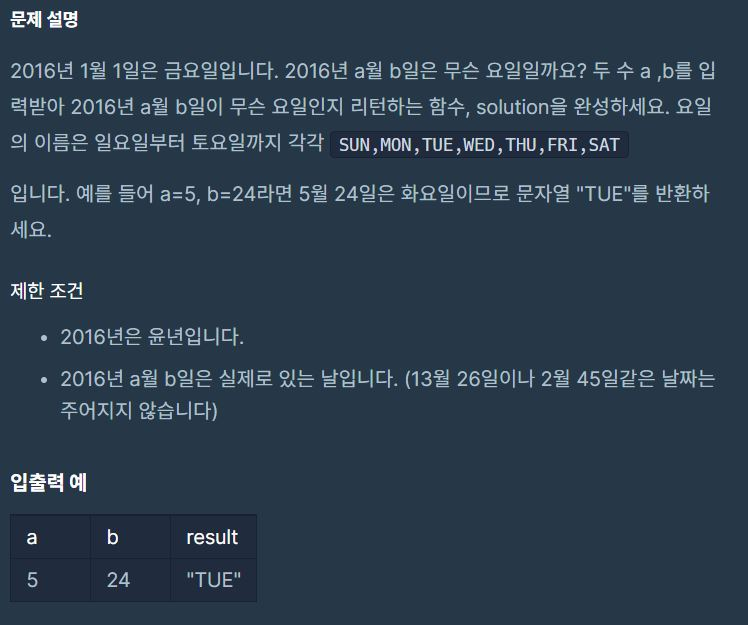

# 2016




## 정답
```Javascript
function solution(2016, a-1, b) {

    // Day 생성자 함수를 통해 a, b 값을 day에 할당. 
    // answer에는 2가 할당된 상태.
    var answer = new Date(a, b).getDay();
    
    // 요일을 의미하는 week 배열 생성
    var week = ['SUN', 'MON', 'TUE', 'WED', 'THU', 'FRI', 'SAT'];
    
    // 2번째 인덱스를 week에서 찾으면 값으로 TUE가 반환됨
    return week[answer];
}
```

#### getMonth() 
  - 객체의 월을 나타내는 정수를 반환함 (0 ~ 11)
  - 1월은 0, 12월은 11.

#### getDay() 
  - 객체의 요일을 나타내는 정수를 반환함
  - 일: 0, 월: 1, 화: 2, 수: 3, 목: 4, 금: 5, 토: 6
<br><br>

## 정답이지만(?) 정확성에 문제있었던 경우
```Javascript
function solution(a, b) {

    // Date의 매개변수를 (월, 일)만 설정하는 경우
    // 2016년 5월 24일이 아닌 다른 날짜가 들어갔을 때 오류가 발생
    var answer = new Date(a, b).getDay(); // Date(a, b)

    var week = ['SUN', 'MON', 'TUE', 'WED', 'THU', 'FRI', 'SAT'];
    
    return week[answer];
}
```
- 우연치 않게 2022년(올해) 5월 24일이 화요일이라 Date(a, b)에 년도가 없음에도 정답으로 처리가 되었다..
- 하지만 위 코드에서 설명했듯이 년, 월, 일 모두 넣어줘야 오류가 발생하지 않는다.

## 오답
```javascript
function solution(a, b) {

    // Day 생성자 함수를 통해 a, b 값을 day에 할당. 
    // answer에는 2가 할당된 상태.
    var day = new Date(a, b).getDay();    

    // 이 상황에서 day.toString() 사용하는 경우,
    // day에 할당된 값 '숫자 2'가 '문자열 2'로 변경되어 출력됨
    // 즉, 결과값(result)는 2.
    var result = day.toString();
    
    return result;
}
```